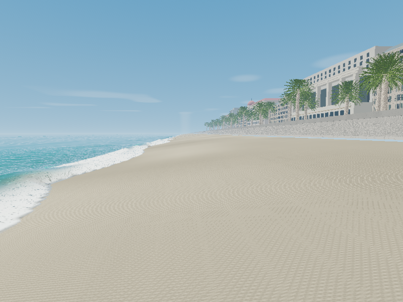

# ShoreBreak — WebCuda

ShoreBreak running through [SamG-Coder's CUDA WebShader / WebCuda](https://github.com/SamG-Coder/cuda-webshader).
Ocean computation, shallow water, foam, wetness, camera physics, geometry intersection,
lighting, spray, bubbles, image filtering, tone mapping and final pixel packing are authored
in CUDA and executed on WebGPU. **The browser does not load Three.js or create a WebGL context.**

Forked from [Christopher Canavan's ShoreBreak](https://github.com/cryptomanavan/ShoreBreak),
created for [awakewithai.com](https://awakewithai.com). Original authorship, MIT licensing,
photo-material attribution, palm credits and source history are preserved.



## Run

Install Node.js 24, then:

```sh
npm ci
npm run dev
```

Open the localhost address printed by Vite. Use a browser with WebGPU and hardware
acceleration. No CUDA Toolkit, NVIDIA-specific API, external compiler checkout, account,
or API key is required. HTTPS is required when serving outside localhost.

The pinned WebCuda compiler and runtime are included in `vendor/cuda-webshader` at
revision `f0f3699b498cfe6fe5419e072a4f4e2faa63b781`. Starting development or building
regenerates all fourteen CUDA artifacts.

## What changed

The WebGL mesh renderer has been replaced by a CUDA compute renderer. CUDA intersects
the water and terrain, queries a stackless BVH containing the original seafront and palm
geometry, shades the result, projects droplets, filters the image and writes packed pixels.
JavaScript copies those pixels directly to the WebGPU canvas; there is no handwritten
presentation shader or Three.js renderer.

The original bathymetry, rock-cluster locations, breaker stage table, initial event timing,
opening viewpoint, seafront geometry and photographic materials are retained. The coast's
core experience remains a walkable beach with breaking water, run-up, persistent wetness,
spray, swimming and underwater views.

**This is a CUDA reimplementation, not a pixel-identical translation of all upstream GLSL.**
The ray renderer, shallow-water discretization, breaker interpolation and lighting differ.
The FFT uses three 128×128 cascades. Shallow water uses a fixed 512×192 region covering
128×18 metres. Palm geometry uses the original tier-1 meshes with shared BVHs.
The old multi-pass contact-light/exposure pipeline, full far-bay panorama and original
volumetric plume are not reproduced identically. See the [migration details](docs/WEBCUDA.md)
for the exact implementation and limits.

Upstream modules remain available as reference and for their numerical regression tests;
the active entry is `src/boot.js` → `src/webcuda/main.js`. Three.js is retained only as a
**development dependency** for those tests and the offline conversion of original scenery.
The production dependency set is empty.

## Controls

| Input | Action |
| --- | --- |
| Click / mouse | Capture pointer / look |
| WASD / arrows | Walk or swim |
| Shift | Move faster |
| C | Toggle crouch; dip underwater when swimming |
| Space | Jump on a new press |
| P | Pause water |
| 1 / 2 / 3 | Normal / quarter / tenth playback speed |
| R | Reset simulation and camera |
| F | Fullscreen |
| H | Controls panel |
| U | Hide interface |
| Escape | Release pointer |

Touch: drag on the right to look; drag on the left to move. Push farther to move faster.
Steady camera disables gait bob. Auto quality adapts render resolution while leaving
simulation resolution fixed. Resolution boosts are honored independently of Auto.

## Build and validation

```sh
npm test                    # 79 upstream regression tests + 3 WebCuda artifact tests
npm run licenses:check      # Original and converted asset checksums / attribution
npm run build               # Compile CUDA, then build dist/
npm run test:webcuda:dist   # Real browser GPU integration / physics / screenshots
npm run preview
```

The GPU integration test needs an installed Chrome or Edge; set `CHROME_PATH` for another
Chromium executable. It validates shader creation, finite/nonnegative water, the resting-lake
invariant, a 30-second simulated run, camera movement, and a non-aligned 641×359 presentation
resize. Screenshots and measured timings are written under `captures/webcuda/`.

Run `npm run bake:cuda-scene` only when changing the original scenery assets. The converted
26.4 MiB BVH is included, so ordinary users do not need the conversion step. Changes to
bundled assets require corresponding checksum updates in `docs/asset-provenance.json`.

Static hosting publishes `dist/`. The inherited Netlify configuration still applies.
The upstream public demo is the original WebGL project, not this fork.

## License

[MIT](LICENSE) for the original project and this port. CUDA WebShader retains its
[MIT license](vendor/cuda-webshader/LICENSE). Included photographic textures remain CC0;
see [asset credits](ASSETS.md), [third-party notices](THIRD_PARTY_NOTICES.md), and
[the original README](docs/UPSTREAM-README.md).
