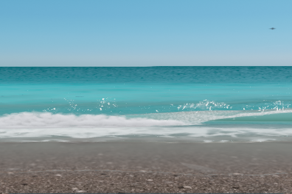
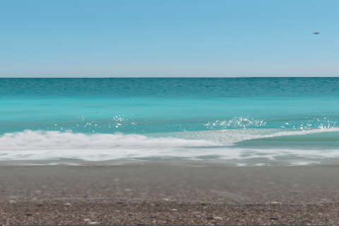

# Faithful CUDA port and validation

The canonical GPU source is the single root **`ShoreBreak.cu`**. The default application runs its graphics stages through WebCuda. The earlier approximate ray renderer and `kernels/*.cu` files have been removed.

## Ported calculations

- Complete original breaker stage, transport, profile, derivative, ballistic lip, injection and foam functions.
- Full original lip cross-section and residual displacement, including crest skin, shoulder, Bezier jet, hanging curtain, cap, underside, fillet, barrel wall and culling.
- Three 256 x 256 ocean cascades with original spectrum evolution, 16 Stockham FFT passes and displacement/slope composition.
- Original Kurganov–Petrova flux: minmod reconstruction, desingularized velocities, wet/dry fallback, hydrostatic balance and boundaries.
- Bed/state initialization, source injection and friction, foam/lace transport, wetness, height/view, scrolling and far-field passes.
- Original water/terrain/scenery graphics, whitewater, underwater effects, contact lighting, exposure and post-processing in both Explore and fixed-camera clip modes.

The file contains **21 diagnostic compute entry points and 186 graphics stages (93 vertex/fragment programs)**. The integrated renderer uses the graphics stages to retain the original render-target precision, texture filtering, blending and pass order. The compute entries provide separate numerical tests of the underlying equations.

The original JavaScript host retains scheduling, initialization, controls, scene construction and CPU math. Three.js CPU classes are retained, while Three.js rendering is replaced. This targets WebCuda's CUDA subset; compilation with NVIDIA nvcc has not been established.

## Reproduce validation

```sh
npm test
npm run test:faithful
npm run test:graphics
npm run build
npm run test:webcuda:dist
node tools/faithful-browser.mjs --dist --clip
node tools/reference-browser.mjs
node tools/reference-browser.mjs --clip
```

GPU tests use Microsoft Edge with working WebGPU on Windows. The numerical oracle executes original GLSL in WebGL2 float32 framebuffers. CUDA runs through the vendored WebCuda compiler on WebGPU, with identical float32 inputs, original event packing and original lookup tables. WebGL is used only by the independent test oracle and upstream reference capture.

The browser integration test loads the complete built application, advances the waves, reads the full-resolution shallow-water state, captures front and underwater views, and exercises a 641 x 359 canvas. It records GPU errors and fails if the application creates a WebGL context. Reports and captures are in `.qa/faithful/`.

`reference-browser.mjs` loads the pinned upstream `11c8c05` entry and original renderer through a test-only Vite transform. It does not modify the application or the CUDA source.

## Numerical results

Validated on NVIDIA Blackwell through Edge WebGPU:

| Comparison | Cases | Failed |
| --- | ---: | ---: |
| Original breaker/wave calculations | 4,096 queries | 0 |
| Original lip cross-section | 4,096 queries | 0 |
| Compute spectrum, FFT and flux | 75 output comparisons | 0 |
| Compute auxiliary swash | 17 output comparisons | 0 |
| Integrated graphics spectrum, FFT and flux | 43 output comparisons | 0 |
| Auxiliary swash, compute and integrated graphics | 34 output comparisons | 0 |
| Graphics stage validation | 93 programs / 186 stages | 0 |
| Original procedural pebble bake | 2 outputs / 131,072 values | 0 |

The graphics FFT chain's largest absolute difference is about 5.5e-6; the 36-step flux comparison differs by about 4.5e-8. Full reports, including worst values and per-pass tolerances, are summarized in `faithful-validation.json`.

Same-time captures at 3.15 seconds in fixed-camera mode:

| WebCuda | Original upstream renderer |
| --- | --- |
|  |  |

GPU math and texture units do not promise bit-for-bit equality. The compute lookup sampler performs float32 interpolation; the original NVIDIA texture unit quantizes interpolation weights. Direct lookup diagnostics therefore use a table-slope-based bound for half an eight-bit filter-weight step plus two coordinate ULPs. Other GPU vendors need their own comparison run.

The FFT slope tolerance permits accumulated spectrum-phase rounding (8e-6 absolute plus 2e-4 relative); isolated FFT uses 2e-7 absolute plus 2e-6 relative. Displacement uses 2e-6 absolute plus 2e-4 relative. Wave/swash diagnostics use 2e-4 absolute plus 2e-4 relative. Final images can differ with texture filtering, floating-point evaluation and rasterization; the tests do not assert pixel identity or long-duration simulation stability.

## Source maintenance

Normal builds compile the existing `ShoreBreak.cu`, using stage IO metadata; they never regenerate its calculations from GLSL. `public/faithful/graphics/build.json` ties source, compiler, metadata and output artifacts together with SHA-256 hashes.

The `tools/port-*.mjs` scripts record the mechanical translation used to author the file. To refresh graphics from the upstream host modules, export both program sets with `tools/native/export.mjs` (`QA_PROGRAMS=.qa/programs.json`, then `QA_MODE=clip` with `QA_PROGRAMS=.qa/programs-clip.json`) and run `tools/port-graphics.mjs`. This is an explicit authoring operation that replaces the graphics sections of the CUDA source. Run all parity checks after changing the source or compiler.
